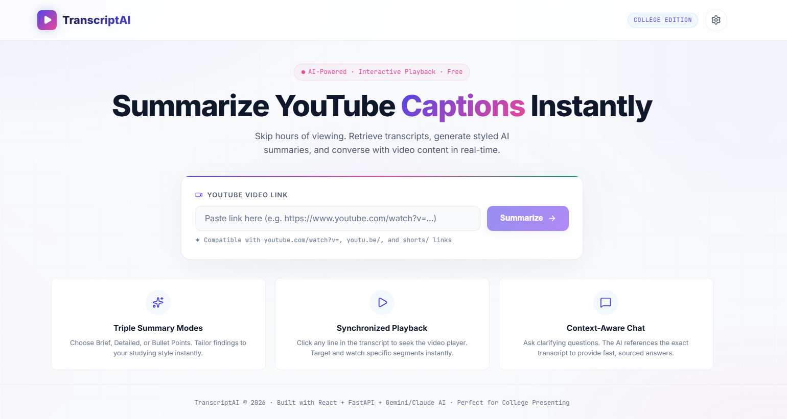
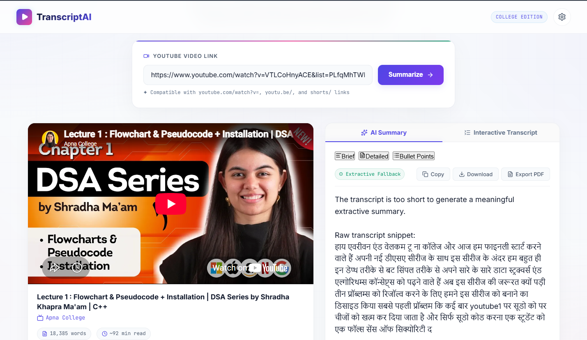
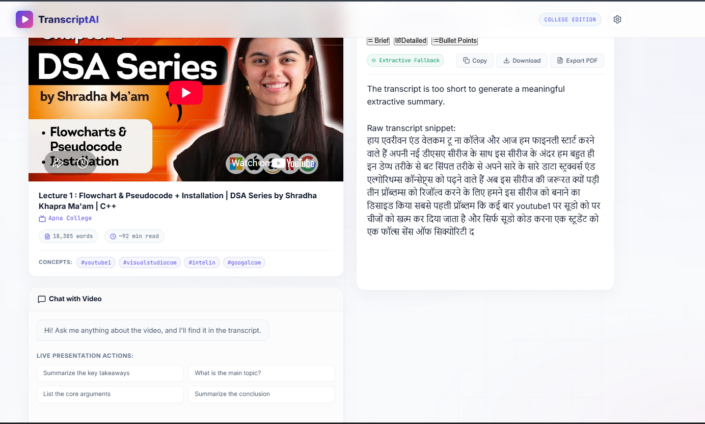
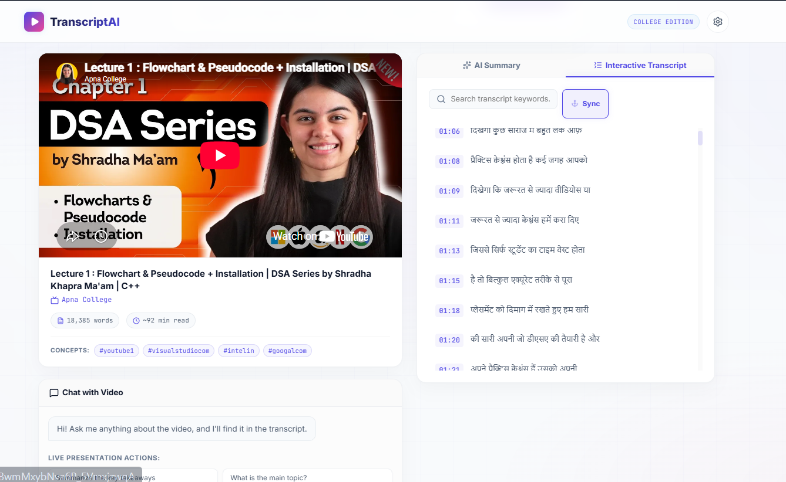
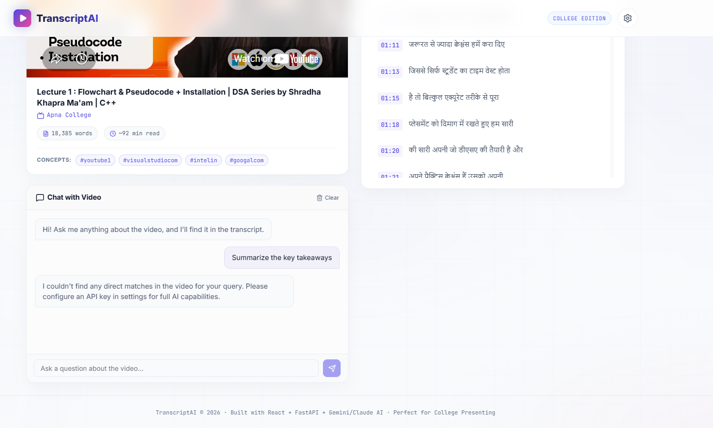

<div align="center">

# 🎬 TranscriptAI

### YouTube Transcript Summarizer & AI Q&A Companion

[](https://python.org)
[](https://fastapi.tiangolo.com)
[](https://reactjs.org)
[](https://vitejs.dev)
[](LICENSE)
[](https://github.com/ashutosh096/youTube_Transcript_Summarizer/stargazers)

**Skip hours of watching. Get AI-powered summaries, interactive transcripts, and chat with any YouTube video — instantly.**

[🚀 Quick Start](#-quick-start) · [✨ Features](#-features) · [🛠️ Tech Stack](#️-tech-stack) · [📸 Screenshots](#-screenshots) · [🔑 API Keys](#-api-keys)

</div>

---

## ✨ Features

<table>
<tr>
<td width="50%">

### 🧠 Triple AI Summary Modes
Choose your style — **Brief** (3-4 sentence overview), **Detailed** (structured with key topics & insights), or **Bullet Points** (top 6-8 takeaways). Switch between modes instantly without re-fetching.

</td>
<td width="50%">

### 🌍 Multi-Language Transcript Support
Automatically detects and retrieves transcripts in any language. Tries English first, then falls back gracefully to auto-generated captions in the video's original language.

</td>
</tr>
<tr>
<td width="50%">

### 🎯 Interactive Synchronized Playback
Click any line in the **Interactive Transcript** tab to instantly seek the embedded YouTube player to that exact moment. Study specific segments effortlessly.

</td>
<td width="50%">

### 💬 Context-Aware AI Chat (Q&A)
Ask anything about the video. The AI references the transcript to give accurate, sourced answers. Works with Gemini, Claude, or a built-in keyword-search fallback.

</td>
</tr>
<tr>
<td width="50%">

### 📄 Export Options
Copy summary to clipboard, download as `.txt`, or **Export to PDF** — formatted with clean typography, headings, and metadata.

</td>
<td width="50%">

### 🔒 Zero Cost to Run (No Key Required)
Works out of the box with extractive summarization and keyword-search Q&A. Plug in your own Gemini or Claude key in Settings for full AI power.

</td>
</tr>
</table>

---

## 🛠️ Tech Stack

| Layer | Technology |
|---|---|
| **Frontend** | React 19, Vite 8, CSS (Glassmorphism UI), Lucide Icons |
| **Backend** | Python, FastAPI, Uvicorn |
| **AI Engines** | Google Gemini 1.5 Flash, Anthropic Claude 3.5 Sonnet |
| **Transcript** | `youtube-transcript-api` + vercel proxy fallback |
| **Metadata** | YouTube oEmbed API (no API key needed) |

---

## 🚀 Quick Start

### 1. Clone the Repository

```bash
git clone https://github.com/ashutosh096/youTube_Transcript_Summarizer.git
cd youTube_Transcript_Summarizer
```

### 2. Install Backend Dependencies

```bash
cd backend
pip install -r requirements.txt
```

### 3. (Optional) Set AI API Keys

Set one or both keys for full AI-powered summaries and chat:

```bash
# Windows
set GEMINI_API_KEY=your_gemini_key_here
set ANTHROPIC_API_KEY=your_claude_key_here

# Mac/Linux
export GEMINI_API_KEY=your_gemini_key_here
export ANTHROPIC_API_KEY=your_claude_key_here
```

> 💡 You can also enter keys directly in the **⚙️ Settings** modal inside the app — no restart required.

### 4. Start the Backend

```bash
uvicorn main:app --reload --port 8000
```

### 5. Start the Frontend

```bash
cd ../frontend
npm install
npm run dev
```

Open **http://localhost:5173** in your browser. The backend runs on **http://localhost:8000**.

---

## 📸 Screenshots

> _Paste a YouTube URL → Get a structured AI summary, interactive transcript, and a full Q&A chatbot — all in one clean interface._

### 1. Modern Bright Landing Page


### 2. Video Analysis & AI Summary Dashboard


### 3. Interactive Synchronized Transcript


### 4. Context-Aware Q&A Chatbot


### 5. API Settings Configuration


---

## 🔑 API Keys

TranscriptAI works without any API key using extractive summarization. For best results:

| Provider | Where to Get | Model Used |
|---|---|---|
| **Google Gemini** | [aistudio.google.com](https://aistudio.google.com/app/apikey) | `gemini-1.5-flash` |
| **Anthropic Claude** | [console.anthropic.com](https://console.anthropic.com/) | `claude-3-5-sonnet-20241022` |

Enter your key(s) in the **Settings (⚙)** button in the top-right corner of the app. Keys are stored locally in your browser — never sent to any server except the respective AI provider.

---

## 📁 Project Structure

```
youTube_Transcript_Summarizer/
├── backend/
│   ├── main.py              ← FastAPI backend (transcripts, AI, chat)
│   └── requirements.txt     ← Python dependencies
├── frontend/
│   ├── src/
│   │   ├── App.jsx          ← Main React application
│   │   ├── App.css          ← Component styles
│   │   ├── index.css        ← Global design system & animations
│   │   └── components/
│   │       ├── YoutubePlayer.jsx   ← Embedded player with seek
│   │       ├── SummaryView.jsx     ← AI summary with export
│   │       ├── TranscriptView.jsx  ← Interactive transcript
│   │       ├── QAPanel.jsx         ← Chat Q&A panel
│   │       └── SettingsModal.jsx   ← API key manager
│   ├── index.html
│   └── package.json
├── assets/
│   └── banner.png
└── README.md
```

---

## ⚙️ How It Works

```
User pastes URL
     │
     ▼
Extract Video ID ──► Fetch Metadata (oEmbed)
     │
     ▼
Fetch Transcript (youtube-transcript-api)
  ├── Try: Manual English captions
  ├── Try: Auto-generated English captions
  └── Fallback: First available language (any)
         └── Attempt English translation
              └── If unavailable → serve original language
     │
     ▼
Generate AI Summary (Gemini → Claude → Extractive)
     │
     ▼
Return to React Frontend
  ├── Embedded YouTube Player (synchronized)
  ├── AI Summary View (3 style modes)
  ├── Interactive Transcript (click-to-seek)
  └── Q&A Chatbot (AI or keyword search)
```

---

## 🤝 Contributing

Contributions, issues, and feature requests are welcome!

1. Fork the repo
2. Create your feature branch: `git checkout -b feature/amazing-feature`
3. Commit your changes: `git commit -m 'Add amazing feature'`
4. Push to the branch: `git push origin feature/amazing-feature`
5. Open a Pull Request

---

## 📄 License

Distributed under the **MIT License**. See `LICENSE` for more information.

---

<div align="center">

Made with ❤️ by [ashutosh096](https://github.com/ashutosh096)

⭐ **Star this repo if you found it useful!** ⭐

</div>
